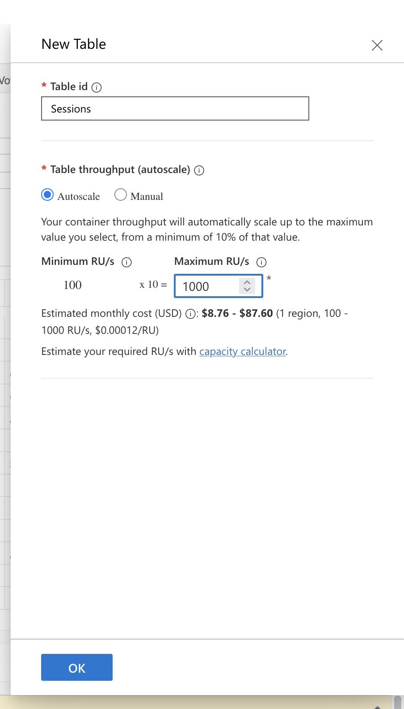
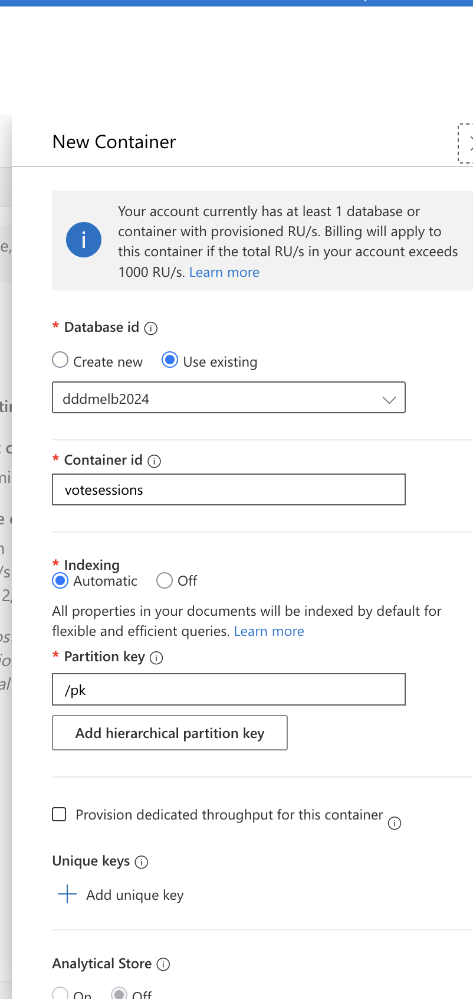
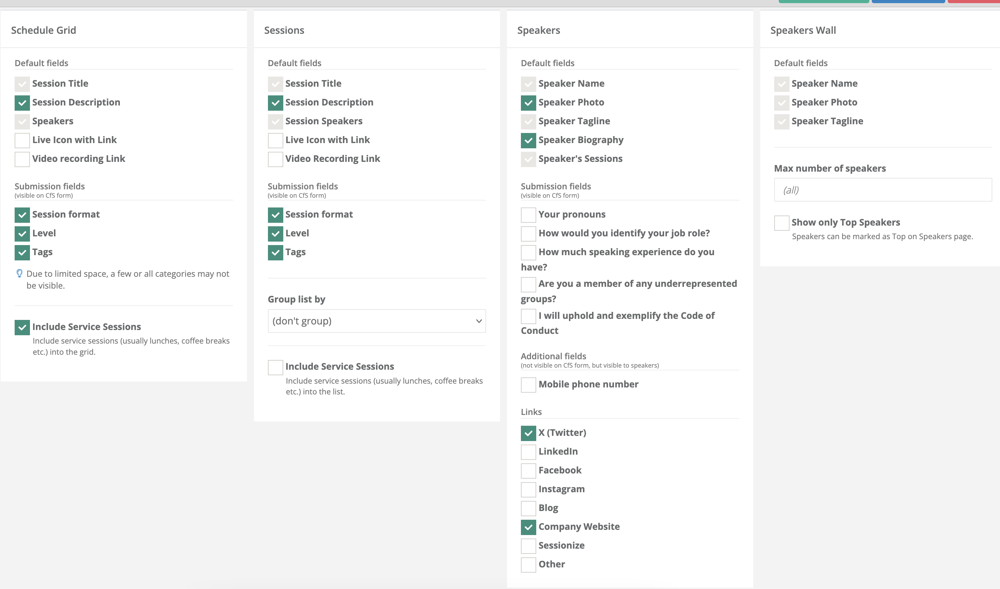
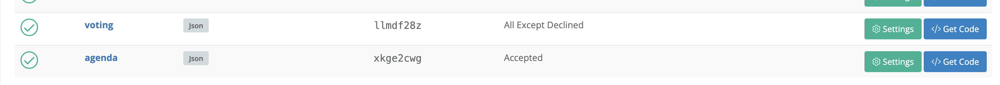
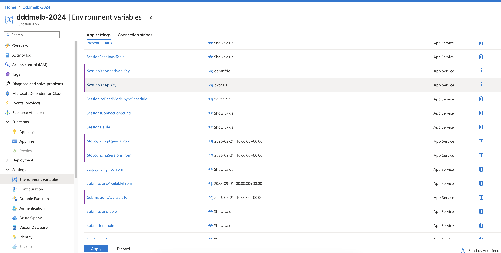

# DDD Backend

This project contains backend functionality to run the DDD conferences, including:

* Syncing data from [Sessionize](https://sessionize.com/) to Azure Table Storage (tenanted by conference year) for submitted sessions (and submitters) and separate to that, selected sessions (and presenters)
* APIs that return submission and session (agenda) information during allowed times
* APIs to facilitate Elo-style voting by the community between (optionally anonymous) submitted sessions (stored in Azure Table Storage tenanted by conference year)

## Run locally

### Prerequisites

* The .NET 10 SDK. `global.json` pins the SDK version.
* Bash and `curl`. The scripts in `scripts/agent/` install the other tools into `.local-tools/`. They do not need `sudo`.

`scripts/agent/setup.sh` installs these tools:

* The .NET 10 SDK, if it is not already installed in `.local-tools/`
* Node.js
* [Azurite](https://learn.microsoft.com/azure/storage/common/storage-use-azurite), which emulates Azure Table, Queue and Blob Storage
* [Azure Functions Core Tools](https://learn.microsoft.com/azure/azure-functions/functions-run-local)

### Commands

Run the full local loop:

```sh
scripts/agent/loop.sh
```

The loop installs the tools, builds the solution and runs the unit tests. Then it starts Azurite and the Functions host, runs smoke tests against the HTTP endpoints, and stops everything. Exit code 0 means that all checks passed.

You can also run each step:

* `scripts/agent/setup.sh`: Install the tools.
* `scripts/agent/test.sh`: Build the solution and run the unit tests.
* `scripts/agent/start.sh`: Start Azurite and the Functions host on `http://localhost:7071`. Set `PHASE=voting` or `PHASE=agenda` to open the matching date windows.
* `scripts/agent/verify.sh`: Run the smoke tests against the running host.
* `scripts/agent/stop.sh`: Stop the Functions host and Azurite.

The logs are in `.local-run/func.log` and `.local-run/azurite.log`.

`DDD.Functions/local.settings.json` holds the local app settings. The Cosmos DB paths (`UserVotingSessions*` settings, used by `EloVotingGetPair`) need the [Cosmos DB emulator](https://learn.microsoft.com/azure/cosmos-db/emulator), so the local loop does not cover them.

## Structure

* `DDD.Core`: Cross-cutting logic and core domain model
* `DDD.Functions`: Azure Functions project (.NET 10, isolated worker) that contains:
  * `EloVotingGetPair`: C# Azure Function that returns the next pair of sessions for Elo voting
  * `EloVotingSubmitPair`: C# Azure Function that validates and persists an Elo vote
  * `GetAgenda`: C# Azure Function that returns sessions and presenters that have been approved for agenda
  * `GetAgendaSchedule`: C# Azure Function that returns agenda schedule from sessionize
  * `GetSubmissions`: C# Azure Function that returns submissions and submitters for use with either voting or showing submitted sessions
  * `SessionizeReadModelSync`: C# Azure Function triggered by a cron schedule defined in config that performs a sync from Sessionize to Azure Table Storage for submissions
  * `SessionizeAgendaSync`: C# Azure Function triggered by a cron schedule defined in config that performs a sync from Sessionize to Azure Table Storage for approved sessions
* `DDD.Functions.Extensions`: App settings, repository set-up and request helpers for `DDD.Functions`
* `DDD.Sessionize`: Syncing logic to sync data from sessionize to Azure Table Storage
* `DDD.Sessionize.Tests`: Unit tests for the Sessionize Syncing code and the encryption helper
* `infra`: Bicep template and deploy script for the Function App. See [infra/README.md](infra/README.md).
* `scripts/agent`: Scripts for the local build, test and smoke-test loop
* `.github/workflows`: GitHub Actions workflows for pull requests and deployment
* `votes-export-to-csv`: Tool that exports the vote tables to CSV

## Backend date parameters and usage

* `StopSyncingSessionsFrom`: this is when we should stop syncing sessions from Sessionize, usually CFP close date
* `StopSyncingAgendaFrom`: this is when we should stop syncing agenda from Sessionize, usually conference date
* `VotingAvailableFrom`: voting start date
* `VotingAvailableTo`: voting end date
* `SubmissionsAvailableFrom`: this is when we can retrieve submitted submissions for internal usage and voting, usually it is the when voting opens
* `SubmissionsAvailableTo`: this is when we cannot retrieve submitted submissions, usually it is when Agenda is published

## Voting session settings

* `UserVotingSessionsConnectionString`: connection string of the Cosmos DB NoSQL account that keeps the Elo voting sessions
* `UserVotingSessionsDatabaseId`: database name in that account
* `UserVotingSessionsContainerId`: container name in that database
* `UserVotingSessionHeaderName`: name of the request header that holds the voting session ID. If you do not set it, the API uses `X-DDDMelbourne-VotingSessionId`.
* `UserVotingSessionTtlSeconds`: time to live of a voting session, in seconds. If you do not set it, the API uses `259200` (3 days).

## Deployment

GitHub Actions builds, tests and deploys the code:

* `.github/workflows/pr.yml` builds the solution and runs the unit tests for each pull request to `master`.
* `.github/workflows/deploy.yml` runs for each push to `master`. It builds, tests and publishes `DDD.Functions`. Then it deploys the package to the Function App `dddmelb-2024-api`.

The deploy workflow signs in to Azure with OpenID Connect (OIDC). It does not use a publish profile or a stored secret. The workflow reads the repository variables `AZURE_CLIENT_ID`, `AZURE_TENANT_ID` and `AZURE_SUBSCRIPTION_ID`. The federated credential trusts only `refs/heads/master`.

The workflow deploys code only. `infra/` defines the Function App and its resources. To change the infrastructure, see [infra/README.md](infra/README.md).

## Prepping for a new year conference

You'd usually would do this before voting opens, that's where the backend needed.

1. Recreate Cosmos Tables in `dddmelb2024`, so they are empty
  * Set maximum 1000 RSU, so they aren't expensive



2. Cleanup Cosmos NoSQL `dddmelb2024nosql`
  * delete and re-create `votesessions` table, so we can get rid of the data
  * use `/pk` for primary key




3. Create two sessionize keys: one for `voting` and one for `agenda`
  * For `voting` pick:
    * Format - JSON
    * Includes Sessions - All except declined
  * For `agenda` pick:
    * Format - JSON
    * Includes Sessions - Accepted
    * Tick everything from the screenshot below






4. Update environment variables in Functions App `dddmelb-2024-api`
  * Go to Functions -> Settings -> Environment Variables
  * `SessionizeApiKey` - use voting API id
  * `SessionizeAgendaApiKey` - use agenda API id
  * `StopSyncingAgendaFrom` - conference date
  * `StopSyncingSessionsFrom` - conference date
  * `SubmissionsAvailableTo` - conference date
  * `VotingAvailableTo` - voting close date 



5. Wait a bit for functions to run and check `Submissions` and `Submitters` tables. They should contain new data.

6. Run website locally and check that voting works

7. Once done some test voting, check that data is populated in "EloVotes" table.